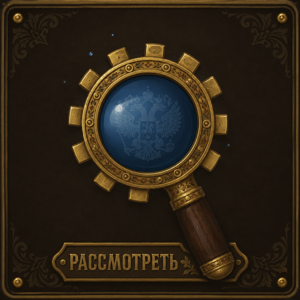

# GearLensRu

Уровень предметов по слотам и проверка снаряжения в окнах персонажа и осмотра
для World of Warcraft Classic: Mists of Pandaria.

GearLensRu показывает уровень каждого надетого предмета прямо на слотах в окне
персонажа и в окне осмотра другого игрока — и сразу отмечает то, что забыли
доделать.

## Возможности

### Уровень предметов

- Число ilvl на каждом слоте, окрашенное по качеству предмета
- Базовый уровень мелким шрифтом рядом, если предмет улучшен
- Средний ilvl над слотами оружия
- Работает и для своего персонажа, и для осматриваемого игрока

### Проверки снаряжения

На проблемном слоте появляется значок предупреждения, детали — по наведению:

- Нет чар (с учетом левой руки и колец у зачаровывателя)
- Пустые гнезда, устаревшие самоцветы, самоцветы низкого качества
- Нет пряжки для пояса
- Нет дополнительного гнезда от кузнечного дела (запястья, кисти рук)
- Нет улучшений инженера: нитроускорители, нейронные пружины, гоблинский планер
- Нарушен бонус специализации брони
- Предмет улучшен не полностью, с указанием текущего и максимального уровня
- Нет гнезда от Ока Черного принца на оружии 522–541 ilvl
- Нет легендарного особого самоцвета в шлеме 522–541 ilvl

Сезонное PvP-снаряжение исключено из последних двух проверок.

### Отчеты из окна осмотра

Кнопки **«Шепнуть игроку»** и **«Отправить в чат»** отправляют список найденных
проблем построчно, с названием слота в начале строки:

```
GearLens: проблемы со снаряжением у Иванко:
[Голова] Нет легендарного особого самоцвета.
[Кисти рук] Нет чар.
[Пояс] Нет пряжки для пояса.
```

Канал выбирается автоматически: рейд, подземелье, группа или обычная речь.

## Установка

1. Распакуйте папку `GearLensRu` в
   `World of Warcraft/_classic_/Interface/AddOns/`
2. Перезапустите игру или выполните `/reload`

## Требования

- World of Warcraft Classic: Mists of Pandaria (интерфейс 50504)
- **Русский клиент.** Аддон разбирает строки подсказок русского клиента
  («Уровень предмета», названия гнезд, описания улучшений инженера), поэтому на
  других языках клиента проверки работать не будут.

## Диагностика

Команда `/glr` выводит в чат состояние определения улучшений инженера и текущий
и базовый ilvl по каждому слоту. Полезна, если проверка ведет себя неожиданно.

Данные читаются через `C_TooltipInfo` со старым способом чтения подсказок как
запасным. Найденные улучшения инженера и уровни улучшения предметов кешируются,
а неполные чтения перепроверяются автоматически — без `/reload`.

## Изменения

См. [CHANGELOG.md](CHANGELOG.md).
